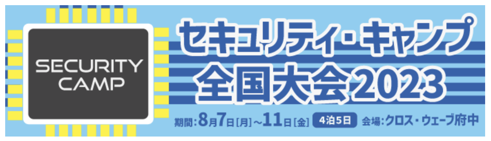
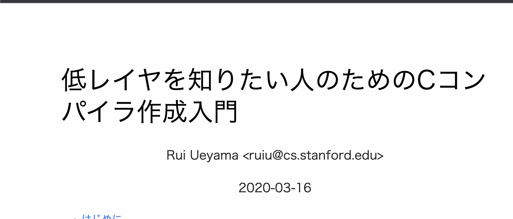
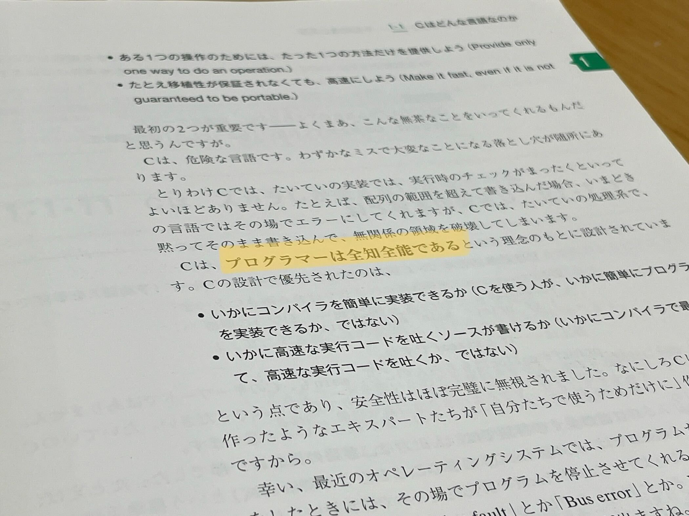

<!--
_paginate: false
footer: 2023/7 jackLT会

-->

# 言語を作りたい

なーこ

---

## お品書き

- きっかけ
- プログラミング言語とは
  - コンピュータは機械語しか理解できない
  - 言語を作るとは？
  - なんで言語を自作するのか？

---

<!--
header: 言語を作りたい：きっかけ
paginate: true
-->

## ５月某日…

---

<!--
_footer: https://www.ipa.go.jp/jinzai/security-camp/2023/zenkoku/index.html
-->

[](https://www.ipa.go.jp/jinzai/security-camp/2023/zenkoku/index.html)

↑ つよつよの人がたくさん来そう！！行きたい！！！！！！

---

色々なゼミがある

- 暗号化通信ゼミ
- 暗号のままで計算しようゼミ
- **C コンパイラゼミ**
- リバースエンジニアリングゼミ
- ハードウェア魔改造ゼミ
- [etc...](https://www.ipa.go.jp/jinzai/security-camp/2023/zenkoku/program_list.html)

---

🤔C コンパイラ作ってみたいなあ…
応募課題をやるために一回コンパイラ作ってみるか！！

---

<!--
_footer: https://www.sigbus.info/compilerbook
-->

↓ つよつよの方が書いた教育的な記事
[](https://www.sigbus.info/compilerbook)

---

(…なんだかんだ忙しくて、結局セキュリティ・キャンプに応募はできませんでした…)

---

<!--
_header: 言語を作りたい
-->

## プログラミング言語とは

---

<!--
header: 言語を作りたい:プログラミング言語とは > コンピュータは２進数しか理解できない
-->

## コンピュータは２進数しか理解できない

- コンピュータは２進数で動いている、というのは有名な話ですが…
- これは一体どういうことでしょう？？

---

- 0 と 1 で書かれた命令の体系のことを機械語と言います。

例：

| 機械語     | 意味      | 例                  |
| ---------- | --------- | ------------------- |
| 0000 x y z | x = y + z | 0000 1000 0000 0001 |
| 0001 x y z | x = y - z | 0001 1000 0000 0001 |

---

- コンピュータはある機械語の体系が実行できるようなハードウェアを持ちます。

例：

| 機械語の体系     | ハードウェアの例                 |
| ---------------- | -------------------------------- |
| ARM              | iPhone, M1Mac, Raspberry Pi など |
| x86_64/x64/AMD64 | PC, Mac(Intel) など              |
| RISC-V           | スマホやマイコンなど             |

---

流石に機械語を人間が書くのはつらい。。。
→ 命令を人間にわかりやすい言葉に置き換えよう
= アセンブリ言語

| 機械語     | アセンブリ言語 | 意味      | 例                  |
| ---------- | -------------- | --------- | ------------------- |
| 0000 x y z | add x y z      | x = y + z | 0000 1000 0000 0001 |
| 0001 x y z | sub x y z      | x = y - z | 0001 1000 0000 0001 |

---

- アセンブリ言語の命令は、機械語（2 進数）に一対一で対応しています
- つまり、アセンブリ言語さえ書ければ（機械語に変換するのは簡単なので）、コンピュータになんでも命令を伝えることができます！
- イメージを湧かせるために、実際のアセンブリ言語を見てみましょう！

---

<!--
_footer: ※1→本当はレジスタのことです。$1, $2, $spなど, $で始まる記号がレジスタのアドレスを表しています。
-->

例えば、コンピュータはこんな命令を解釈できます。

```mips
命令 オペランド(引数。取れる数は決まっている)

add x, y, z     # x = y + z
sub x, y, z     # x = y - z
slt x, y, z     # if x = y < z then 1 else 0
j target        # goto target
```

<span style="color: gray;">
(x, y, z は変数だと思って良いです(※1))
</span>

<span style="color: gray;">
(MIPS という命令の体系を使った場合)
</span>

---

試しに、実際のプログラムをアセンブリに変換してみましょう。

```C
int main() {
    int x = 1;
    int y = 2;
    int z = 3;
    int a = x + y;
    int b = y - z;
    return 0;
}
```

---

<!--
_footer: 注:https://godbolt.org/ で、コンパイラにmips clang 16.0.0を用いた。
-->

実際のプログラムをアセンブリに変換すると…

```mips
main:                                   # @main
        addiu   $sp, $sp, -32
        sw      $ra, 28($sp)                    # 4-byte Folded Spill
        sw      $fp, 24($sp)                    # 4-byte Folded Spill
        move    $fp, $sp
        sw      $zero, 20($fp)
        addiu   $1, $zero, 1          <----- x = 0 + 1
        sw      $1, 16($fp)
        addiu   $1, $zero, 2          <----- y = 0 + 2
        sw      $1, 12($fp)
        addiu   $1, $zero, 3          <----- z = 0 + 3
        sw      $1, 8($fp)
        lw      $1, 16($fp)
        lw      $2, 12($fp)
        addu    $1, $1, $2            <----- a = x + y
        sw      $1, 4($fp)
        lw      $1, 12($fp)
        lw      $2, 8($fp)
        subu    $1, $1, $2            <----- b = y - z
        sw      $1, 0($fp)
        addiu   $2, $zero, 0
        move    $sp, $fp
        lw      $fp, 24($sp)                    # 4-byte Folded Reload
        lw      $ra, 28($sp)                    # 4-byte Folded Reload
        addiu   $sp, $sp, 32
        jr      $ra
        nop
```

---

ぎゃー、、、😱😱😱😱😱😱
これだけのことをやるのにこのアセンブリ量…
大きなコードだと、とても人力で書けたものではありませんね……
C みたいな低級な高級言語でも、コンパイラに感謝してプログラムを書きましょう。

---

ということで、コンピュータの中で機械語が動いているイメージが湧いたでしょうか？

---

<!--
header: 言語を作りたい:プログラミング言語とは > 言語を作るとは？
-->

## 言語を作るとは？

---

言語を作る＝高級言語から機械語に変換するプログラムを作ること

---

「高級言語から機械語に変換するプログラム」

- コンパイラ(e.g. C, Go, Rust)
- インタプリタ(e.g. Python, PHP, Ruby, Python, JS)

---

言語を作る
= 高級言語から機械語に変換するプログラムを作ること

= インタプリタやコンパイラを作ること

---

<!--
header: 言語を作りたい:プログラミング言語とは > なんで言語を自作するのか？
-->

## なんで言語を自作するのか？

---

既存の言語でも文句を言いたくなる点は多い

JS の勝手な型変換とか…

```js
> "\t" == 0
true
> "\t" == "0"
false
> [] == 0
true
> [] == "0"
false
```

---

Python も型変換が…

```python
>>> {True: 'yes', 1: 'no', 1.0: 'maybe'}
{True: 'maybe'}
```

---

<!--
_footer: 前橋和弥, 「C言語ポインタ完全制覇」, 2017/12/21, 初版, p.31
-->

C 言語は全知全能の人間にしか書けない()し…



---

言語を自作するメリット

- コンピュータに関する理解が深まる
- 既存の言語をもっと使いこなせるようになる
- 既存の言語に不満があるときに、建設的なアイデアを出せるようになる
- なんなら欠点を解消した言語を作ることができる

---

<!--
header: Appendix:コンパイラの仕事とは？
-->

## Appendix: コンパイラの仕事とは？

---

さて、先程出てきたコンパイラは、このように C 言語をアセンブラに変換しています。

C 言語

```C
x = x + 1;
```

↓ (コンパイル)

```mips
addiu $1, $1, 1
```

アセンブラ(MIPS)

---

これは一体どのようにして実現されているのでしょうか？

---

単純に考えると、C 言語のコードを一文字ずつ見ていって、対応するアセンブリを出力すれば良いのではないか、と思うかもしれません。

---

例えば、もっとも単純な電卓プログラムのコンパイラを考えてみましょう。
次の場合はどうしたらいいでしょうか？

```C
x = x + 1 + 2 + y;
```

次のように掛け算割り算、かっこなどの優先順位が発生したら？

```C
x = (x + 1) * 2 + y;
```

---

すべての場合を考えて if 文を書いたりすることもできなくはないですが、かなり辛そうです。

---

そこで、昔の賢い人が考えた方法を導入してみましょう…と言いたいところですが、ここの解説は、

https://www.sigbus.info/compilerbook#%E9%9B%BB%E5%8D%93%E3%83%AC%E3%83%99%E3%83%AB%E3%81%AE%E8%A8%80%E8%AA%9E%E3%81%AE%E4%BD%9C%E6%88%90

を読んでいただければと思います。

---

<!--
header: Appendix:実際のインタプリタやコンパイラのコード
-->

## Appendix: 実際のインタプリタやコンパイラのコード

---

CPython：

- コード: https://github.com/python/cpython
- Python Developer's Guide: https://devguide.python.org/

---

Ruby:

- コード: https://github.com/ruby/ruby

---

C 言語の実装:

- https://github.com/rui314/chibicc

---

<!--
_header: 参考
-->

## 参考

- 2023 年春１期情報学部の「計算機アーキテクチャ基礎及び演習 1・2」の授業および授業資料
- David Patterson / John L. Hennessy 著,『コンピューターの構成と設計　上』（通称パタヘネ）, 第６版, 日経 BP, 2022, 380p.
- Rui Ueyama,「低レイヤを知りたい人のための C コンパイラ作成入門」,2020/03/16, https://www.sigbus.info/compilerbook, 2023/07/12 閲覧

---

<!--
_header: ""

-->

## ご清聴ありがとうございました！
