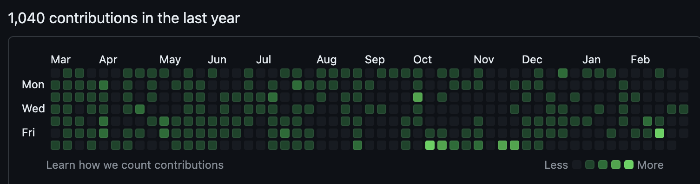

<!--

## メモ

### 一番伝えたいこと

メイン:
開発するときはコード書く前に全部計画しよう

サブ:
しくじってもいいから何でもやってみよう
何かしら好きなことやってたらなんとかなる

### メイン

業務でコードを書くことになった２年生のなーこ…
→ 仕事を頼まれる
→ コード書いてたらなんか出来上がってるやろ!!!()()()
→ やることわかったしとりあえずコード書こう！！
→ あれ私今何やってるんだっけ…？同時多発するバグの数々……期限通りに終わらせられないタスク…
→ 書かなくて良いコード書いてぬまったり…コードが書けないと思いきや仕様が明確じゃなかったからだったり…
→ 生産性 ❌！

いかにしてこの状況を脱したか？
（職場の上司）「要件定義 → 設計 → 実装 → テストの流れをやれ」
（なーこ）「了解です」
（なーこ）Notion に要件定義、設計のドキュメントを作成
（上司）色々指摘
（なーこ）手戻りが減ってうれしい
(なーこ)…！？！？みるみるうちにコードが書けるっっっっっっっ！考えなくても手が動くっっっっっ！！！！なんて素晴らしいんだ！！！！

みんなに伝えたいこと

- 手を動かすフェーズと、考えるフェーズは分けたほうが効率が良いよ
- 一旦抽象的に見通しを立ててからコード書くと楽だよ
- 全部ドキュメントに残しておくと明日の自分が困らないよ

## 余談：もっといろんなしくじり

### 誰が見てもすごいと思うやってきたこと

- 諸々のインターン行ったよ
- 諸々のイベント行ったよ
- GitHub めっちゃ草生えてるよ
- いろいろ作ったよ
- いっぱい CS の授業うけたよ

### その裏のいろいろなしくじり

- インターンで自分一人で考えすぎて質問できなかったよ、めっちゃ仕事止めたよ
- sudo rm -rf / 実行してみたよ、メイン PC で
- 自分一人でものを作って、本番で失敗して微妙な雰囲気になったよ
- 東京のイベントに初めて参加してキョドって全然人に話しかけられなかったよ
- 開発してたら生活習慣終わってたよ
- インターン先が不法な契約してきたよ
- やろうとしたプロジェクト消滅させちゃったよ
- インターンも留学も落ちたよ
- セキュリティ・キャンプも落ちたよ
- CS の授業で危うく落単しかけたよ
- 大量の作るっていって作ってないプロジェクトたちがあるよ
- やるって言って作って、作りきらないままめんどくなって放置してるサイトの数々があるよ

→ 正味、今ではあんまり気にしてない（迷惑かけた人ごめん…）

- しくじっても後から見れば大したことはない
- しくじってもいいから何でもやってみよう

-->

## いきなりコードを書くな！計画をしろ！

---

<!--
header: はじめに
footer: 2024/3 しくじりLT
paginate: true
-->

## はじめに

- コードを書く時、どこから手を付けていますか？
- まさか…いきなりコードを書いたり、なんてしてませんよね…？

---

## はじめに

- コードを書く時、どこから手を付けていますか？
- まさか…いきなりコードを書いたり、なんてしてませんよね…？**← 去年の私です()**

---

<!--
header: しくじりの詳細
-->

## 再現

(上司)「 このページを実装してください！欲しい機能は〜〜で、ここにはバリデーションをかけて…デザインはこれね！」

(なーこ)「 了解です！」

---

## 再現

(な)「おっしゃーコード書くぞ〜〜〜！」
(な)「とりあえずここから手を付けるか〜」

〜１時間後〜

(な)「あれ…詰まってたらいつの間にか何をやっていたかわからなくなった…何やってたんだっけ………？」
(な)「えーい！やるしかない！がんばるぞ！！」

---

## 再現

(な)「すみません…今日までのタスク終わりませんでした…」
(上)「あー、、、じゃあ明日までにお願いしますね！」

---

## 再現

(な)「実装できました！」
(上)「確認しますね」
(上)「ここの機能がおかしいですね…仕様だとこうなっていて…」
(な)「あれ…」
(上)「もうちょっと早めに確認させてほしかったですね…」
(な)「すみません…直します…」

---

## いきなりコードを書き始めると…

- やることが多すぎて、何をやっていたかわからなくなる
- 予想外のところで沼って、思ったよりも時間がかかってしまう
- 全部できあがってから仕様との食い違いが発覚して、手戻りが発生

---

## どうすればよかったのか？

<!--
header: どうすればよかったのか？
-->

(上)「**要件定義 → 設計 → 実装**の流れでやってみて」

(な)「了解です」

→ 結果めっちゃうまく行った。生産性爆上がり

---

## 要件定義

(な)「とりあえず要件をしっかり固めるぞ！」
（Notion ｶｷｶｷ…✍️）

> - 例: 機能の詳細
>   - ボタンを押した時の挙動
>   - バリデーションの内容
>   - 必要なデータ

(な)「要件できた！上司に見てもらお！」
(上)「ここはこうしたほうがいいですね」
(な)「了解です！」
(な)（これ、実装途中に聞いてたらやばかったな…ふう…）

---

## 設計

(な)「次は設計だ！」
（Notion ｶｷｶｷ…✍️）

> - 例: データの流れ
>   - コンポーネントの引数はどうする？
>   - 実データは誰が持つか？親コンポーネント？
>   - API を叩くのはどの階層のコンポーネント？

(な)「設計できた！上司に見てもらお！」
(上)「ここはこうしたほうがいいですね」
(な)「了解です！」
(な)「実装する前にきれいなアーキテクチャになって良いぞ…！」

---

## 実装

(な)「実装だ！」
(ｶﾀｶﾀｶﾀｶﾀｶﾀｶﾀｶﾀｶﾀ…⌨️)
(な)（設計の通りにコード書くだけでいいんだ！！！）
(な)（スルスル書ける…！！書けるぞ！！！しかも品質も良い気がする…！！）
(な)（見通しが立ってるから、スケジュール通りに進むぞ…！）

---

## 完成

(な)「出来ました！プルリクの確認お願いします」
(上)「確認しますね」
(上)「問題ないですね！マージします！」
(な)「やったぜ！！！✨」

---

<!--
header: 要件定義 → 設計 → 実装
-->

## これまで何が問題だったのか

- 今まで：**いきなりコードを書いていた**
  - ＝「**要件の確認**」「**コードの設計・ロジックの考案**」「**コードを書くための調べ物**」が**同時進行**
  - → 何やってるかわからなくなる
  - → 予想以上に時間がかかる
  - → それぞれの作業が中途半端になる
  - → 生産性が悪くなる 😱

---

## 要件定義 → 設計 → 実装とは

- 「要件定義・設計」の頭を使うフェーズと、「実装」の手を動かすフェーズを分けること

---

## 要件定義 → 設計 → 実装の具体例

- 要件定義
  - 何を作るのかを明確にする
  - 例: padding の大きさ、ボタンの色、バリデーションの内容
- 設計
  - 要件を満たすような実装方法を考える
  - 例: どのような関数を作るか、データの流れ、コンポーネントの階層構造
- 実装 → 手を動かすだけ

---

## 要件定義 → 設計 → 実装のメリット

- 全部ドキュメントに残しておくと明日の自分が困らない
  - 「昨日の作業を思い出す時間」が短くなる
  - 思考の抽象的な部分もドキュメントにしたためておこう
- 実装する前に上司に確認してもらえる
  - 手戻りが減る
- 実装のときにコードを書くことに集中できる

---

## 要件定義 → 設計 → 実装のまとめ

- 「要件定義・設計」の頭を使うフェーズと、「実装」の手を動かすフェーズを分けること
- 全部ドキュメントに残しておくと明日の自分が困らない
- 設計が残ってると、作業が途中で終わっても思い出すのが楽

---

## まとめ

- いきなりコードを書くな
- 要件定義 → 設計 → 実装の流れでやってみよう

---

<!--
header: 余談：もっといろんなしくじり
-->

## 余談：もっといろんなしくじり

---

<!--
_footer: しばしお付き合いください…
-->

## なーこ意外とすごい…？

- いろいろインターン行ったり…
- 教育プログラムに参加したり…
- GitHub の草が茂ってるし…
  
- Public なリポジトリ 30 個ぐらいあるし…
- いろんな言語書けるし…
- CS の授業大量に受けてたし…

---

<!--
_footer: イラスト：脳マネジメントによって、体力、ビジネス力、コミュニケーション力などあらゆる人間力が飛躍的に活性化された、ハピネス社会の男性のイラストです。©いらすとや \n ※元ネタ良く知らないです…ごめんなさい…

-->

## 実はスーパー日本人なのでは…？

---

## そんなはずもなく…

たくさんしくじって、そのうちいくつかがたまたまうまく行った(ように見える)だけです…

---

<!--
_footer: ""
_header: ""
-->

## いろんなしくじり

- チームでやってるのに自分一人でものを作って、本番で失敗して微妙な雰囲気になったよ
- 開発してたら生活習慣終わってたよ。毎日 3 時に寝てたよ
- やろうとしたプロジェクト消滅させちゃったよ
- `sudo rm -rf /` 実行してみたよ、メイン PC で
- インターンで自分一人で考えすぎて質問できなかったよ、めっちゃ仕事止めたよ
- 東京のイベントに初めて参加してキョドって全然人に話しかけられなかったよ
- 大量の作るっていって作ってないプロジェクトたちがあるよ
- 作りきらないままめんどくなって放置してるサイトの数々があるよ
- インターンも留学もセキュリティ・キャンプも応募して落ちたよ
- CS の授業で危うく落単しかけたよ

---

全部語ってるとオーバーなので省略…

---

## 伝えたいこと

- しくじっても後から見れば大したことはない
- やってみないと何も始まらない
- しくじってもいいから何でもやってみよう
