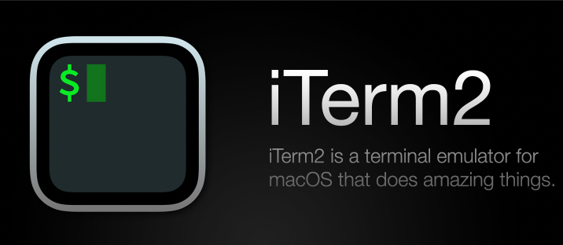
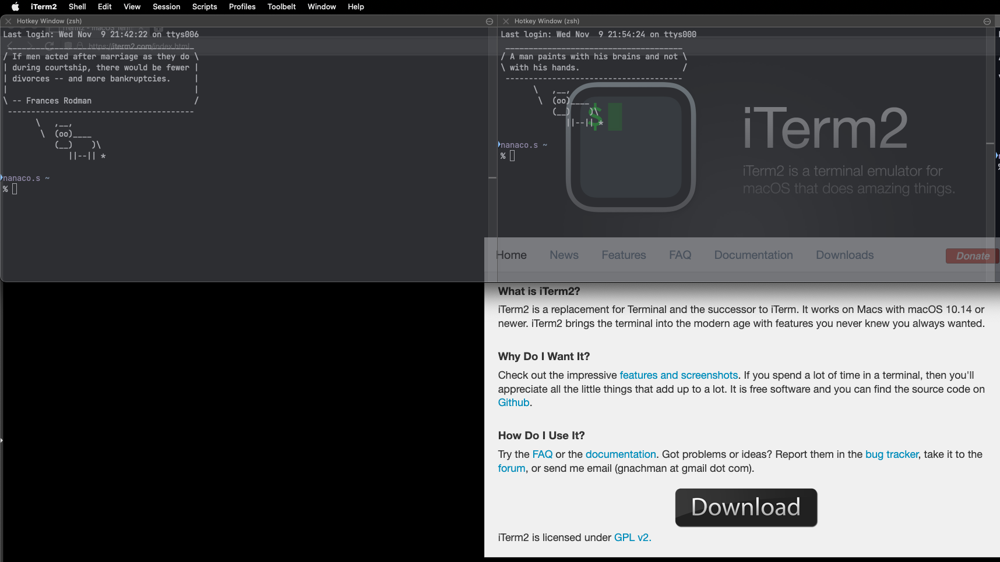
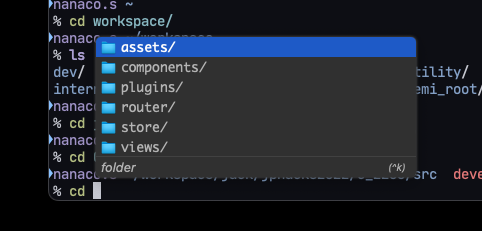
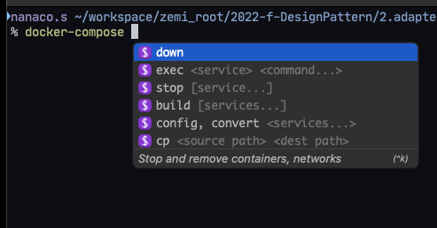
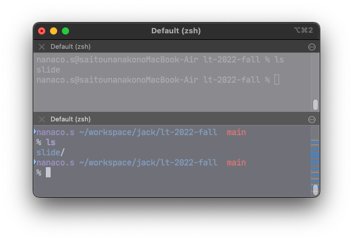
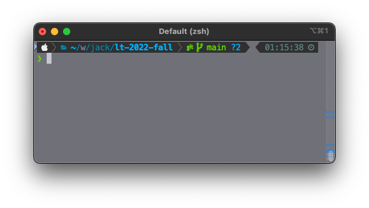
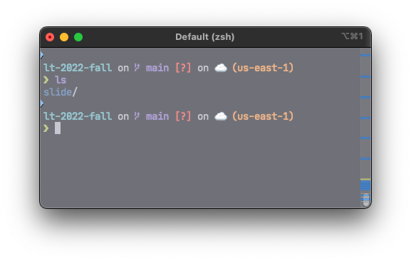

<!--_class: title-->

<h1 class="title">最高に怠惰なターミナルを作ろう </h1>

---

おしながき

### 1. iterm(ターミナル)

### 2. fig(ターミナル補完)

### 3. zsh(シェル)

### 4. z, fzf コマンド

### 5. dotfiles(設定ファイル)

---

<!-- class: slide terminal-->

## 1. iterm

- 画面が分けれる
- 上からにょっ
- テーマを変える

---

## 1. iterm

- 画面が分けれる
- ⌘D
  

---

## 1. iterm

- 上からにょっ
- Hotkey 機能
- control ダブルタップで出せる
- [https://amateur-engineer-blog.com/iterm2-hotkey/](https://amateur-engineer-blog.com/iterm2-hotkey/)

---

## 2. fig

- ターミナルのコマンドをサジェスト
- よく使うコマンドが上に出てくる

---

## 2. fig

- ターミナルのコマンドをサジェスト
- よく使うコマンドが上に出てくる
- docker や git などサブコマンドも出てくる

---

## 3. .zshrc

- zshの設定ファイル
- プロンプトを変える
- git-prompt とか
- [https://zenn.dev/kaityo256/articles/zsh-vcs-prompt](https://zenn.dev/kaityo256/articles/zsh-vcs-prompt)

---

## 3. .zshrc

- プロンプトを変える
- powerlevel10k とか
- [https://github.com/romkatv/powerlevel10k](https://github.com/romkatv/powerlevel10k)

---

## 3. .zshrc

- プロンプトを変える
- starship とか(powershell でも使える)
- [https://starship.rs/ja-jp/](https://starship.rs/ja-jp/)

---

## 4. z

- ディレクトリに飛べるコマンド
- [https://qiita.com/ucan-lab/items/6cd64e5bec6c3c50e7dc](https://qiita.com/ucan-lab/items/6cd64e5bec6c3c50e7dc)

---

## 4. fzf

- あいまい検索ツール
- [https://qiita.com/kamykn/items/aa9920f07487559c0c7e](https://qiita.com/kamykn/items/aa9920f07487559c0c7e)

---

## 5. dotfiles

- 設定ファイルを集めるもの
- シンボリックリンクを貼って使う

---
